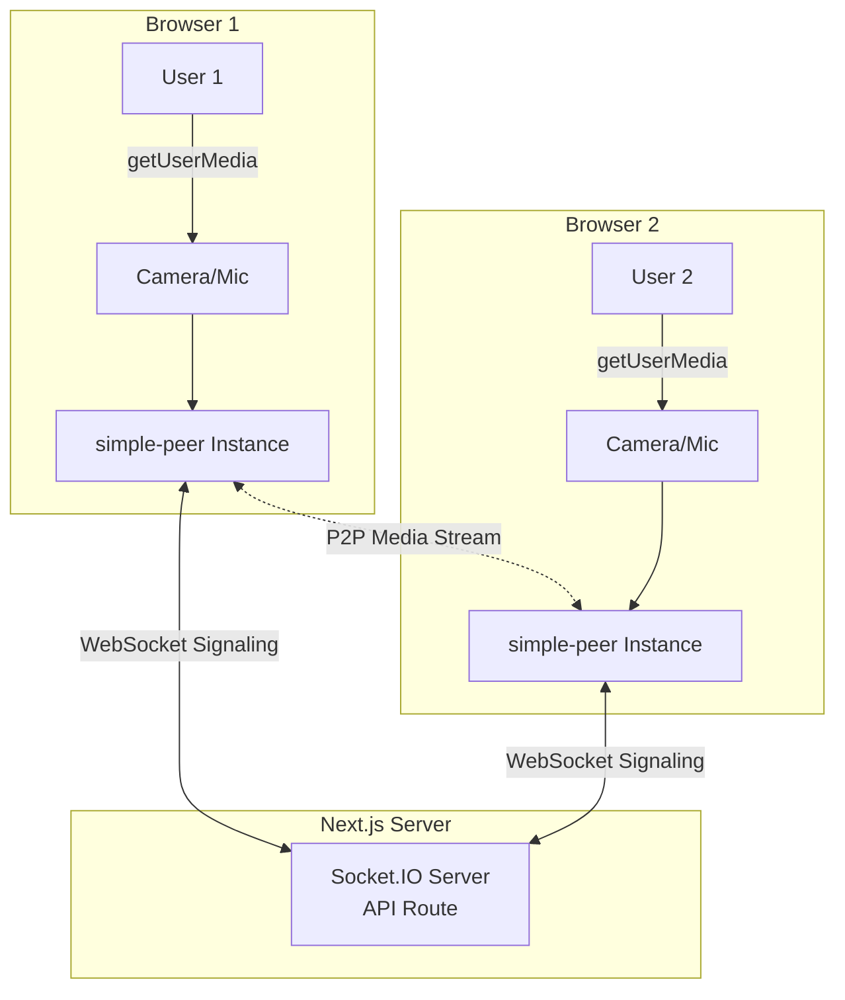

# Video Call App - simple-peer Implementation Plan

A precise implementation plan for building a Teams-like video call app using **Next.js**, **simple-peer**, and **Socket.IO**.

> [!NOTE]
> This plan focuses exclusively on **simple-peer**. Other libraries can be explored later.

## Technology Stack

| Component | Library | Reason |
|-----------|---------|--------|
| WebRTC | **simple-peer** | TypeScript-friendly, simple API, catches errors early |
| Signaling | **Socket.IO** | Real-time WebSocket, works with Next.js API routes |
| UI | **shadcn/ui** | Already installed, TypeScript-safe components |
| State | **React Hooks** | No external state lib needed, simple & type-safe |

> [!NOTE]
> **No STUN/TURN servers needed** for localhost/LAN development. Will add later for production cross-network connections.

## Architecture Overview



## Implementation Phases

### Phase 1: Dependencies & Socket.IO Server
Install packages and set up signaling infrastructure.

### Phase 2: Media Hooks & WebRTC Logic
Build React hooks for camera/mic and peer connections.

### Phase 3: UI Components
Create video grid, control panel, and meeting UI.

### Phase 4: Meeting Pages
Build landing page, lobby, and room pages.

### Phase 5: Chat & Screen Share
Add text chat and screen sharing features.

---

## Proposed Changes

### Phase 1: Core Infrastructure

#### [MODIFY] [package.json](file:///e:/workspace/video-call/package.json)
Install dependencies:
```bash
npm install simple-peer socket.io socket.io-client
npm install --save-dev @types/simple-peer
```

**Dependencies Explained:**
- `simple-peer` - WebRTC wrapper with TypeScript definitions
- `socket.io` - Server-side signaling (runs in Next.js API route)
- `socket.io-client` - Client-side signaling
- `@types/simple-peer` - TypeScript types for compile-time safety

---

#### [NEW] [lib/socket.ts](file:///e:/workspace/video-call/src/lib/socket.ts)
Socket.IO client singleton for signaling.

**Purpose:** Central Socket.IO client that connects to our signaling server.

**Code Pattern:**
```typescript
import { io, Socket } from 'socket.io-client';

let socket: Socket | null = null;

export const getSocket = (): Socket => {
  if (!socket) {
    socket = io({
      path: '/api/socket',
      transports: ['websocket'],
    });
  }
  return socket;
};
```

---

#### [NEW] [app/api/socket/route.ts](file:///e:/workspace/video-call/src/app/api/socket/route.ts)
Next.js API route for Socket.IO server.

**Purpose:** Signaling server that relays WebRTC signals between peers.

**Key Events:**
- `join-room` - User joins a room
- `signal` - WebRTC signal (offer/answer/ICE)
- `user-joined` - Notify others of new peer
- `user-left` - Handle peer disconnect

**Architecture Note:** In Next.js App Router, we'll use a custom server middleware pattern or upgrade HTTP connection to WebSocket.

---

### Phase 2: WebRTC Hooks

#### [NEW] [hooks/useMediaStream.ts](file:///e:/workspace/video-call/src/hooks/useMediaStream.ts)
Hook for managing local camera/microphone stream.

**Purpose:** Get user's camera/mic with TypeScript-safe error handling.

**Return Values:**
```typescript
{
  stream: MediaStream | null;
  isLoading: boolean;
  error: Error | null;
  toggleAudio: () => void;
  toggleVideo: () => void;
  isAudioEnabled: boolean;
  isVideoEnabled: boolean;
}
```

**Features:**
- Request camera/mic permissions
- Toggle audio/video tracks on/off
- Handle permission denials gracefully
- Cleanup on unmount

---

#### [NEW] [hooks/useSocket.ts](file:///e:/workspace/video-call/src/hooks/useSocket.ts)
Hook for Socket.IO signaling with type-safe events.

**Purpose:** Connect to signaling server and manage room events.

**Return Values:**
```typescript
{
  socket: Socket | null;
  isConnected: boolean;
  joinRoom: (roomId: string, userId: string) => void;
  leaveRoom: (roomId: string) => void;
}
```

**Events Emitted:**
- `join-room` - Join meeting room
- `signal` - Send WebRTC signal to peer
- `leave-room` - Exit meeting

**Events Listened:**
- `user-joined` - New peer joined
- `signal` - Receive WebRTC signal
- `user-left` - Peer disconnected

---

#### [NEW] [hooks/useWebRTC.ts](file:///e:/workspace/video-call/src/hooks/useWebRTC.ts)
Main WebRTC hook using simple-peer.

**Purpose:** Manage peer connections, handle signaling, track remote streams.

**Parameters:**
```typescript
interface UseWebRTCProps {
  roomId: string;
  userId: string;
  localStream: MediaStream | null;
}
```

**Return Values:**
```typescript
{
  peers: Map<string, {
    peerId: string;
    stream: MediaStream | null;
    peer: SimplePeer.Instance;
  }>;
  isInitiator: boolean; // First person in room
}
```

**simple-peer Logic:**
1. When user joins, check if room is empty → initiator = true
2. For each peer:
   - Create `new SimplePeer({ initiator, stream: localStream })`
   - Listen for `signal` event → send via Socket.IO
   - Listen for `stream` event → save to state
3. When receiving signal from Socket.IO → `peer.signal(data)`
4. Clean up on unmount

---

#### [NEW] [hooks/useMediaDevices.ts](file:///e:/workspace/video-call/src/hooks/useMediaDevices.ts)
Hook for device enumeration and selection.

**Purpose:** List available cameras/mics, allow switching.

**Return Values:**
```typescript
{
  devices: {
    audioInputs: MediaDeviceInfo[];
    videoInputs: MediaDeviceInfo[];
  };
  selectedDevices: {
    audioId: string | null;
    videoId: string | null;
  };
  switchCamera: (deviceId: string) => Promise<void>;
  switchMicrophone: (deviceId: string) => Promise<void>;
}
```

---

### Phase 3: Video Components

#### [NEW] [components/video/VideoGrid.tsx](file:///e:/workspace/video-call/src/components/video/VideoGrid.tsx)
Responsive grid displaying all participants.

**Props:**
```typescript
interface VideoGridProps {
  localStream: MediaStream | null;
  peers: Map<string, { stream: MediaStream | null; peerId: string }>;
  localUserId: string;
}
```

**Layout Logic:**
- 1 user: Full screen (100vw x 100vh)
- 2 users: Side-by-side (50vw each)
- 3-4 users: 2x2 grid (50vw x 50vh)
- 5-9 users: 3x3 grid (33vw x 33vh)
- 10+ users: Scrollable grid with pagination

**Uses:** `VideoTile` component for each stream

---

#### [NEW] [components/video/VideoTile.tsx](file:///e:/workspace/video-call/src/components/video/VideoTile.tsx)
Individual video element for a participant.

**Props:**
```typescript
interface VideoTileProps {
  stream: MediaStream | null;
  peerId: string;
  isLocal?: boolean;
  isMuted?: boolean;
  name?: string;
}
```

**Features:**
- `<video>` element with `autoPlay` and `playsInline`
- `muted={isLocal}` to prevent echo on local video
- Audio level indicator (visualize volume)
- Name badge overlay
- Connection status (connecting/connected/failed)
- Fallback avatar when video is off

**Styling:** Uses shadcn/ui `Card` component

---

#### [NEW] [components/video/ControlPanel.tsx](file:///e:/workspace/video-call/src/components/video/ControlPanel.tsx)
Meeting controls at bottom of screen.

**Props:**
```typescript
interface ControlPanelProps {
  isAudioEnabled: boolean;
  isVideoEnabled: boolean;
  onToggleAudio: () => void;
  onToggleVideo: () => void;
  onLeave: () => void;
  onToggleChat?: () => void;
  onShareScreen?: () => void;
}
```

**Buttons:**
- Microphone (Mic / MicOff icons)
- Camera (Video / VideoOff icons)
- Screen Share (Monitor icon)
- Chat (MessageSquare icon)
- Leave Call (PhoneOff icon, red background)

**Styling:** Fixed bottom bar with glassmorphism effect

**Uses:** shadcn/ui `Button`, `Tooltip` components

---

#### [NEW] [components/video/ParticipantList.tsx](file:///e:/workspace/video-call/src/components/video/ParticipantList.tsx)
Sidebar showing all participants.

**Props:**
```typescript
interface Participant {
  id: string;
  name: string;
  isAudioEnabled: boolean;
  isVideoEnabled: boolean;
  isLocal: boolean;
}

interface ParticipantListProps {
  participants: Participant[];
  isOpen: boolean;
  onClose: () => void;
}
```

**Features:**
- List of participants with avatar (shadcn/ui `Avatar`)
- Mic/camera status icons
- "You" badge for local user
- Slide-in animation from right

---

### Phase 4: Meeting Pages

#### [MODIFY] [app/page.tsx](file:///e:/workspace/video-call/src/app/page.tsx)
Landing page with modern design.

**Features:**
- Hero section with gradient background
- "Create New Meeting" button → generates random room ID, redirects to `/room/[id]`
- "Join Meeting" input + button
- Feature cards (HD video, screen share, chat, free)
- Responsive design with animations

**Uses:** shadcn/ui `Button`, `Input`, `Card`

---

#### [NEW] [app/lobby/page.tsx](file:///e:/workspace/video-call/src/app/lobby/page.tsx)
Pre-meeting device setup page.

**Features:**
- Camera preview (local stream)
- Display name input
- Device selection dropdowns (camera/mic)
- "Join Meeting" button
- Permission error handling

**Flow:**
1. Request camera/mic permissions
2. Show preview
3. Allow device selection
4. Save name to localStorage
5. Navigate to `/room/[roomId]?name=...`

**Uses:** `useMediaStream`, `useMediaDevices` hooks

---

#### [NEW] [app/room/[roomId]/page.tsx](file:///e:/workspace/video-call/src/app/room/[roomId]/page.tsx)
Main meeting room page.

**Features:**
- Video grid showing all participants
- Control panel at bottom
- Chat sidebar (toggleable)
- Participant list (toggleable)
- Auto-cleanup when user leaves

**Hooks Used:**
- `useMediaStream` - Get local camera/mic
- `useSocket` - Connect to signaling server
- `useWebRTC` - Manage peer connections
- `useState` - Chat/participant list visibility

**Layout:**
```
┌─────────────────────────────┐
│      Video Grid (main)      │
│   (VideoGrid component)     │
│                             │
├─────────────────────────────┤
│    Control Panel (fixed)    │
└─────────────────────────────┘
```

---

### Phase 5: Additional Features

#### [NEW] [components/chat/ChatPanel.tsx](file:///e:/workspace/video-call/src/components/chat/ChatPanel.tsx)
Text chat sidebar.

**Features:**
- Message list (scrollable)
- Message input with emoji picker
- Timestamps
- "User is typing..." indicator

**Data Channel:** Use simple-peer's data channel feature
```typescript
peer.on('data', (data) => {
  const message = JSON.parse(data.toString());
});
peer.send(JSON.stringify({ type: 'chat', text: 'Hello' }));
```

**Uses:** shadcn/ui `ScrollArea`, `Input`, `Card`

---

#### [NEW] [hooks/useScreenShare.ts](file:///e:/workspace/video-call/src/hooks/useScreenShare.ts)
Screen sharing functionality.

**Purpose:** Capture screen and replace video track in peer connection.

**Return Values:**
```typescript
{
  isSharing: boolean;
  startScreenShare: () => Promise<void>;
  stopScreenShare: () => void;
  error: Error | null;
}
```

**Logic:**
1. `navigator.mediaDevices.getDisplayMedia()`
2. Get screen stream
3. Replace video track: `peer.replaceTrack(oldTrack, newTrack, stream)`
4. On stop, restore camera track

---

## File Structure

```
video-call/
├── src/
│   ├── app/
│   │   ├── api/
│   │   │   └── socket/
│   │   │       └── route.ts          # Socket.IO server
│   │   ├── room/
│   │   │   └── [roomId]/
│   │   │       └── page.tsx          # Meeting room
│   │   ├── lobby/
│   │   │   └── page.tsx              # Device setup
│   │   └── page.tsx                  # Landing page
│   ├── components/
│   │   ├── video/
│   │   │   ├── VideoGrid.tsx
│   │   │   ├── VideoTile.tsx
│   │   │   ├── ControlPanel.tsx
│   │   │   └── ParticipantList.tsx
│   │   ├── chat/
│   │   │   └── ChatPanel.tsx
│   │   └── ui/                       # shadcn components
│   ├── hooks/
│   │   ├── useMediaStream.ts
│   │   ├── useMediaDevices.ts
│   │   ├── useSocket.ts
│   │   ├── useWebRTC.ts
│   │   └── useScreenShare.ts
│   └── lib/
│       ├── socket.ts                 # Socket client
│       └── utils.ts                  # Helpers
└── package.json
```

---

## simple-peer Configuration

### Basic Configuration (Localhost/LAN)

For development and local network testing, no ICE server configuration needed:

```typescript
const peer = new SimplePeer({
  initiator: true,
  stream: localStream
  // No config needed for localhost/LAN!
});
```

> [!NOTE]
> This works perfectly for:
> - Testing on localhost (different browser tabs)
> - Same local network (LAN) connections
> - Development phase
> 
> STUN/TURN servers can be added later for production cross-network connections.

### Error Handling
```typescript
peer.on('error', (err) => {
  console.error('Peer error:', err);
  // Show user-friendly message
  // Try to reconnect
});

peer.on('close', () => {
  // Remove peer from state
  // Update UI
});
```

---

## Socket.IO Events Schema

### Client → Server
```typescript
socket.emit('join-room', { roomId, userId, userName });
socket.emit('signal', { roomId, targetUserId, signal });
socket.emit('leave-room', { roomId, userId });
```

### Server → Client
```typescript
socket.on('user-joined', ({ userId, userName }) => {
  // Create peer connection (initiator = true)
});

socket.on('signal', ({ fromUserId, signal }) => {
  // Pass signal to existing peer
  peer.signal(signal);
});

socket.on('user-left', ({ userId }) => {
  // Close peer connection, remove from UI
});
```

---

## Verification Plan

### Manual Testing (Primary Method)

#### Test 1: Two-Peer Connection
1. Start dev server: `npm run dev`
2. Browser 1: Create meeting
3. Browser 2 (incognito): Join with room ID
4. **Expected**: Both see each other's video with audio

#### Test 2: Controls
1. In active call
2. Toggle microphone
3. **Expected**: Audio mutes, peer sees indicator
4. Toggle camera
5. **Expected**: Video stops, shows avatar

#### Test 3: Screen Share
1. Click screen share button
2. Select window/screen
3. **Expected**: Peer sees shared screen

### Automated Tests (Optional)
Since WebRTC requires real browser APIs, automated testing is complex. Focus on unit testing utility functions.

---

## Implementation Order

1. ✅ Install dependencies
2. ✅ Create Socket.IO server (`app/api/socket/route.ts`)
3. ✅ Build `useMediaStream` hook
4. ✅ Build `useSocket` hook  
5. ✅ Build `useWebRTC` hook with simple-peer
6. ✅ Create `VideoTile` component
7. ✅ Create `VideoGrid` component
8. ✅ Create `ControlPanel` component
9. ✅ Build landing page (`app/page.tsx`)
10. ✅ Build lobby page (`app/lobby/page.tsx`)
11. ✅ Build room page (`app/room/[roomId]/page.tsx`)
12. ✅ Test two-peer connection
13. ✅ Add `ChatPanel` with data channels
14. ✅ Add `useScreenShare` hook
15. ✅ Polish UI/UX

---

**Ready to start implementation?** All libraries are free, TypeScript-safe, and simple to use.

