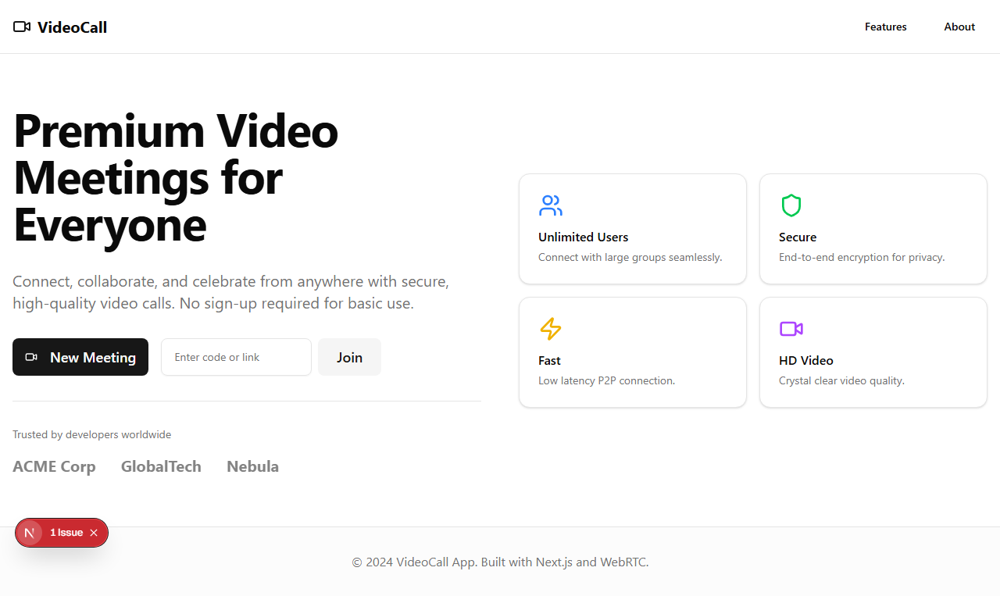
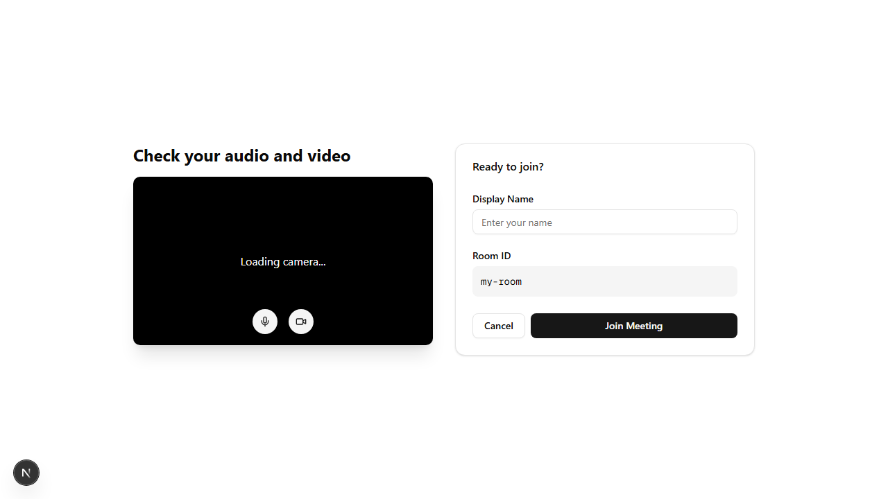
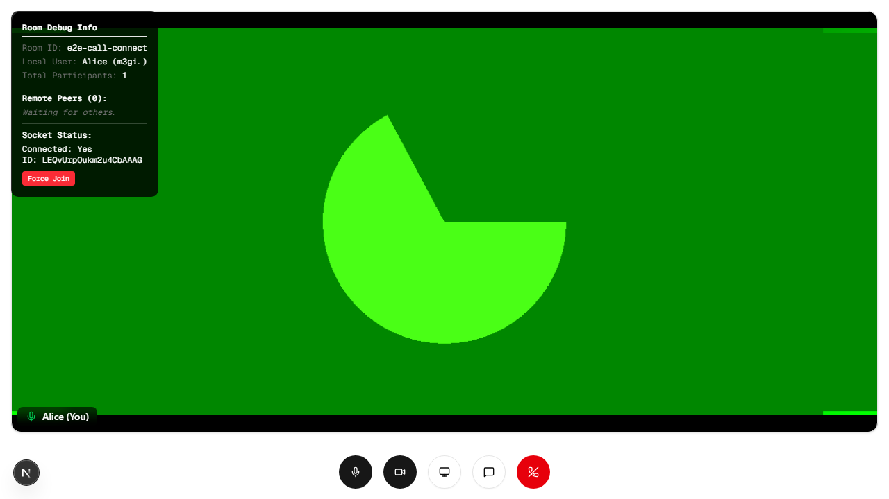
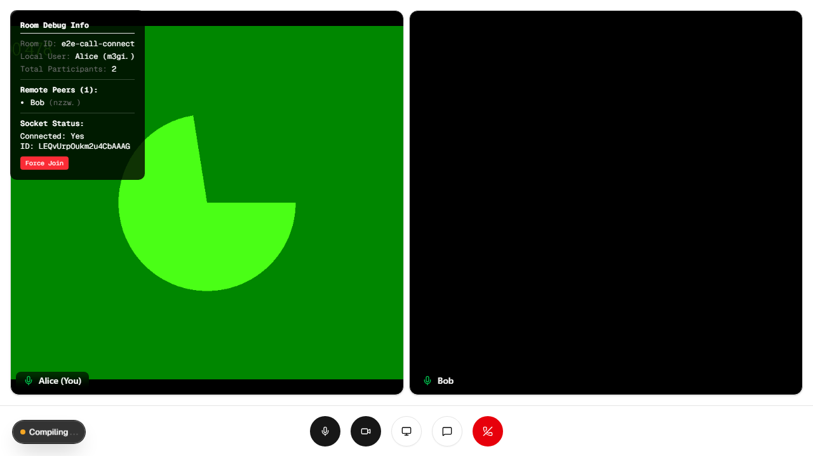
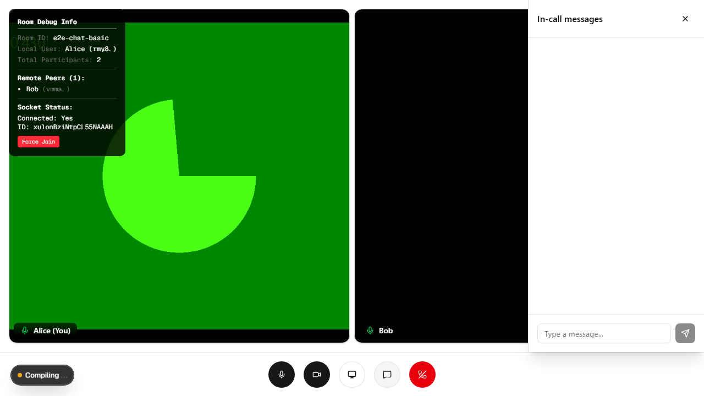
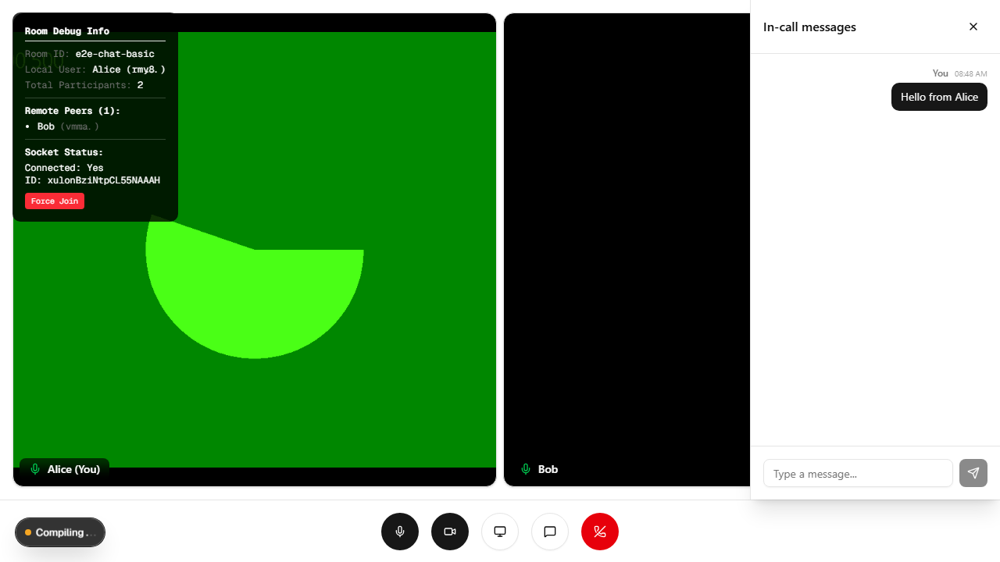
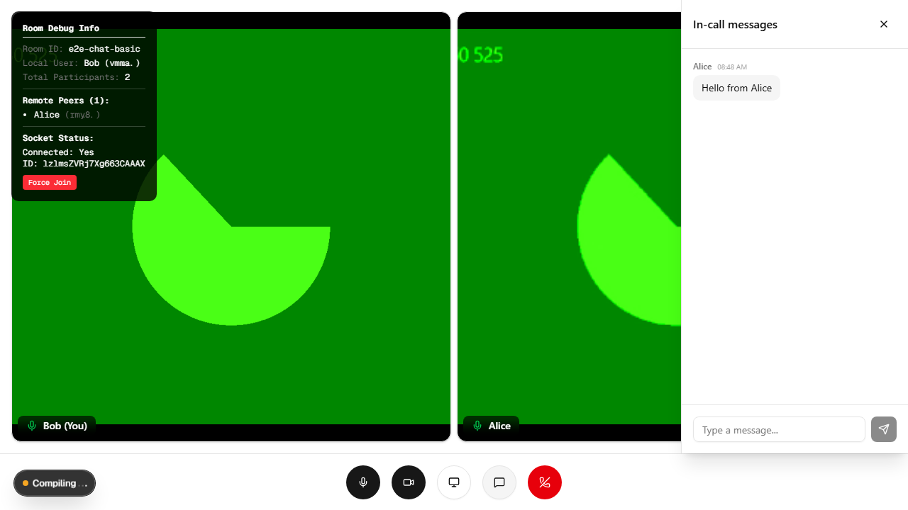
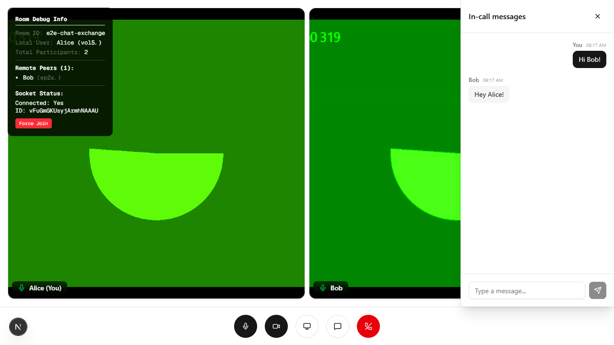
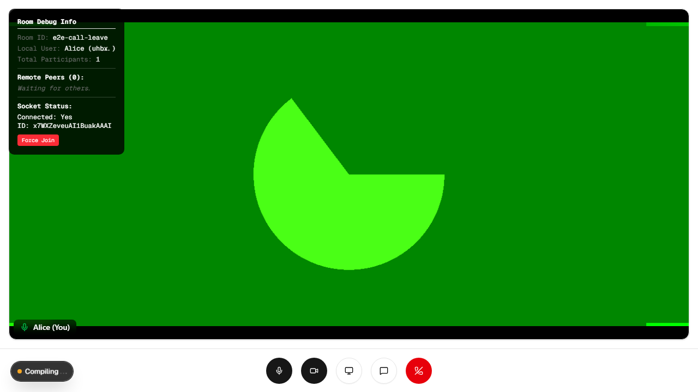

# VideoCall — WebRTC PoC

ブラウザ間の P2P ビデオ通話 PoC。Next.js App Router + simple-peer + Socket.IO で構成。

## Tech Stack

| レイヤー | 技術 | バージョン |
|---|---|---|
| Framework | Next.js (App Router) | 16.0.5 |
| Language | TypeScript | 5.x |
| UI | React 19 + Tailwind v4 + shadcn/ui | – |
| WebRTC | simple-peer | 9.11.1 |
| Signaling | Socket.IO | 4.8.1 |

## アーキテクチャ

```
Browser A                    Signaling Server (port 4001)       Browser B
   │                                    │                           │
   ├── join-room ─────────────────────► │                           │
   │ ◄── existing-users ─────────────── │                           │
   │                                    │ ◄── join-room ────────────┤
   │ ◄── user-joined ───────────────────┤                           │
   ├── signal (offer) ──────────────── ►│──── signal ──────────────►│
   │ ◄── signal (answer) ───────────────┤◄─── signal ───────────────┤
   │◄════════════ P2P WebRTC stream ════════════════════════════════►│
```

### 主要ファイル

```
src/
├── app/
│   ├── page.tsx              # ランディングページ（ルーム作成・参加）
│   ├── lobby/page.tsx        # 参加前プレビュー画面
│   └── room/[roomId]/page.tsx # 通話メイン画面
├── hooks/
│   ├── useMediaStream.ts     # カメラ・マイク・画面共有
│   ├── useSocket.ts          # Socket.IO 接続管理
│   └── useWebRTC.ts          # P2P 接続・シグナリング処理
├── lib/
│   └── socket.ts             # Socket.IO クライアントシングルトン
└── components/
    ├── video/VideoGrid.tsx   # ビデオグリッドレイアウト
    ├── video/VideoTile.tsx   # 参加者ビデオタイル
    ├── video/ControlPanel.tsx # ミュート・共有・退出ボタン
    └── chat/ChatPanel.tsx    # チャットサイドパネル
server.js                     # シグナリングサーバー（standalone）
```

## 画面一覧 / ユーザーマニュアル

> 詳細な手順は **[docs/user-manual.md](./docs/user-manual.md)** を参照してください。

### ① トップページ — ルームの作成・参加



「New Meeting」で新しいルームを作成、またはルームIDを入力して「Join」で既存のルームに参加します。

---

### ② ロビー — カメラ・マイク確認



入室前にカメラ映像を確認し、表示名を設定します。マイク・カメラのオン/オフも事前に切り替えられます。

---

### ③ 通話室 — 接続待ち / 通話中

| 待機中 | 2人接続時 |
|---|---|
|  |  |

相手が参加すると自動的にWebRTC P2P接続が確立し、映像・音声が届きます。

---

### ④ テキストチャット

| チャットを開く | 送信側（You ラベル） | 受信側（名前ラベル） |
|---|---|---|
|  |  |  |

下部の💬ボタンでチャットパネルを開きます。送ったメッセージは「You」、受け取ったメッセージは相手の名前付きで表示されます。

双方向のやり取り例：



---

### ⑤ 退出後の画面



参加者が退出すると相手のタイルが消え、残ったユーザーが全画面表示に戻ります。

---

## Getting Started

**ターミナル 1** — シグナリングサーバーを起動

```bash
node server.js
# → Socket.IO server running on port 4001
```

**ターミナル 2** — Next.js 開発サーバーを起動

```bash
npm run dev
# → http://localhost:3000
```

同一 LAN の別ブラウザで http://\<your-ip\>:3000 を開いてルーム ID を共有すると P2P 通話が確立する。

## Scripts

```bash
npm run dev          # 開発サーバー
npm run build        # プロダクションビルド
npm run start        # プロダクション起動

# テスト
npm run test:e2e     # Playwright E2E テスト（ヘッドレス）
npm run test:e2e:ui  # Playwright UI モード
npm run test:e2e:report # テストレポートを開く

# Lint / Format
npm run lint         # ESLint (Next.js 標準)
npm run lint:ox      # oxlint（高速 Rust 製リンター）
npm run lint:ox:fix  # oxlint 自動修正
npm run fmt          # oxfmt フォーマット（Prettier 互換）
npm run fmt:check    # フォーマットチェックのみ
```

## ⚠️ 既知の問題（本番・ネット越し接続）

詳細は [AGENTS.md](./AGENTS.md#ネット接続の問題点) を参照。

| 問題 | 場所 | 影響 |
|---|---|---|
| Socket URL ハードコード | `src/lib/socket.ts:7` | ローカル以外からシグナリング不可 |
| STUN/TURN 未設定 | `src/hooks/useWebRTC.ts:82,138` | NAT 越え P2P 接続失敗 |
| HTTP のみ | – | ブラウザが getUserMedia をブロック（localhost 除く） |
| CORS ワイルドカード | `server.js:6` | 本番では要制限 |

## E2E テスト

```bash
npm run test:e2e
```

Playwright + Chromium で実行。カメラ・マイクは `--use-fake-device-for-media-stream` でモック済み。
シグナリングサーバーなしで動作する（ローカルへの接続失敗を含めて検証）。

テスト構成:

| ファイル | 内容 |
|---|---|
| `e2e/home.spec.ts` | ランディングページの UI とナビゲーション |
| `e2e/lobby.spec.ts` | ロビーのカメラプレビューとフォーム |
| `e2e/room.spec.ts` | 通話室の接続状態 + ネットワーク障害ドキュメント |
| `e2e/call.spec.ts` | 2ブラウザ間 WebRTC 通話（接続・退出） |
| `e2e/chat.spec.ts` | 2ブラウザ間チャット（送受信・ラベル・ルーム分離） |

テスト実行時は各ステップのスクリーンショットが `test-screenshots/` に自動保存されます。

## ドキュメント

| ファイル | 内容 |
|---|---|
| [docs/user-manual.md](./docs/user-manual.md) | スクリーンショット付きユーザーマニュアル |
| [docs/pitfalls.md](./docs/pitfalls.md) | 実装で踏んだハマりポイント集 |
| [AGENTS.md](./AGENTS.md) | AI エージェント向けコードガイド |
